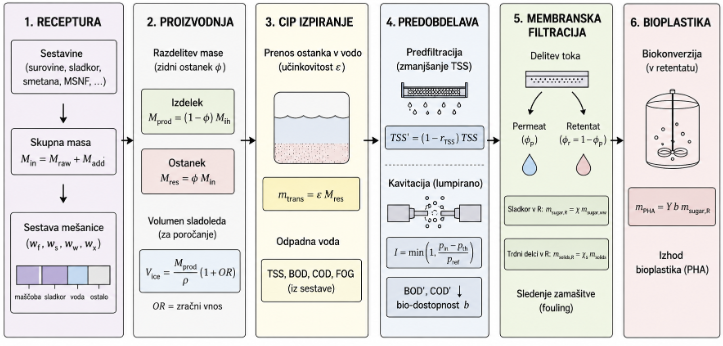
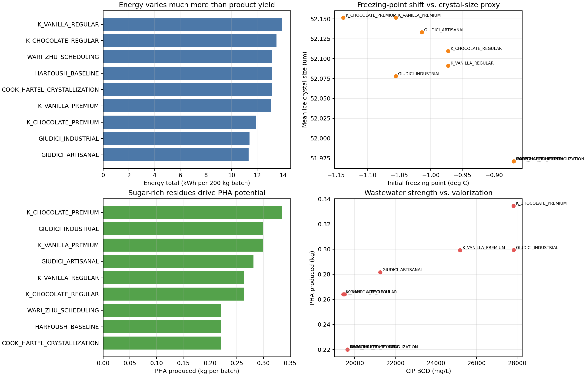

**A DETERMINISTIC DIGITAL-TWIN FRAMEWORK FOR ICE CREAM PRODUCTION AND WASTEWATER VALORIZATION**

Gal Gantar1, Valter Hudovernik1, Mark Znidar1, Dr. Joze Rozanec2

Prof. Dr. Ivan Bratko1

1 University of Ljubljana, Faculty of Computer and Information Science, Vecna pot 113, 1000 Ljubljana

2 Jozef Stefan International Postgraduate School

**Corresponding author:** insert e-mail address

**Abstract**

The transition to Industry 4.0 and the human-centric Industry 5.0 vision place artificial intelligence and digital twins at the centre of European manufacturing strategy. One research direction is the cognitive digital twin: an engineering simulator coupled with a reasoning layer that interprets results, surfaces trade-offs and supports operator decisions. This article situates one such effort, a deterministic digital-twin framework for ice cream manufacturing and wastewater valorization, within that broader agenda.

Industrial ice cream production generates wastewater primarily during cleaning-in-place (CIP) operations, containing dissolved sugars, suspended solids, fats, proteins and cleaning residues. Conventional dairy wastewater treatment removes much of the particulate and fat-rich load, but dissolved carbohydrates remain an important contributor to chemical oxygen demand (COD); the same organic fraction is a recoverable carbon source. The simulator follows a material batch from ingredient preparation through pasteurization, homogenization, cooling, ageing, dynamic freezing, hardening and packaging, and then models the generation and treatment of CIP wastewater. In the baseline scenario, production-side mass balance closes, prefiltration removes 62 % of TSS, and nanofiltration plus theoretical PHA conversion yields 1.10 kg PHA per tonne of raw mix. These PHA values represent conversion potential under an assumed yield coefficient, not reactor productivity or downstream recovery. We discuss how AI optimization, explainability and reasoning-capable models can extend this deterministic core into a cognitive digital twin suitable for industrial use.

**Keywords**

Industry 4.0/5.0, cognitive digital twin, reasoning AI, ice cream, wastewater, CIP, hydrodynamic cavitation, nanofiltration, PHA, mass balance

## 1. Introduction

### 1.1 Industry 4.0/5.0 and the strategic role of artificial intelligence

Industry 4.0 refers to the integration of cyber-physical systems, industrial sensors, cloud computing and data analytics into manufacturing, so that factories can observe their own state and adjust operation in near-real time. Industry 5.0, formulated by the European Commission in 2021, adds a human-centric and sustainability-oriented emphasis: automation should support skilled workers, improve resilience and make energy, water and material use explicit design constraints.

For Slovenia and the wider European Union, this transition is directly relevant to small and mid-sized food, pharmaceutical and chemical plants. These plants must improve product quality while reducing energy use, water consumption and effluent loads. In the European policy context, this is linked to the green transition, strategic autonomy, supply-chain resilience and circular-economy doctrine. Besides defining operating costs, water, energy and organic carbon are constrained resources whose use must be justified.

Artificial intelligence enters this picture at several layers. Machine-learning models can extract patterns from sensor streams, detect anomalies or estimate quality variables that are too expensive to measure directly. Optimization methods can suggest set-points that balance throughput, energy use and quality. More recently, reasoning-capable models offer a possible interface between these computational tools and human engineers, because they can summarize assumptions, compare scenarios and explain why a recommendation follows from a given model.

### 1.2 Digital twins and cognitive digital twins

A digital twin is a virtual representation of a physical process, kept synchronized with the real system through sensor data and engineering models. In the strict definition, a digital twin is live: its state evolves with the plant and its predictions are continuously testable against measurements. In many research and pilot applications, the term is also used for an engineering model designed for later synchronization with plant data.

The cognitive digital twin (CDT) extends this idea by adding a reasoning layer over the engineering model. Such a layer should not replace the simulator; it should help interpret simulation outputs, compare them with historical or contextual knowledge, and propose actions with stated assumptions and uncertainties. In a food plant, this means connecting operational decisions — recipe changes, cleaning volume, membrane fouling, wastewater load — to consequences that an engineer can inspect.

### 1.3 Reasoning-capable AI and its relevance to cognitive digital twins

Recent progress in large language models has produced systems that can reason in natural language, write and execute code, call external tools and explain intermediate steps [26-29]. For an industrial digital twin this is relevant in three ways. First, such a model could act as an orchestrator, selecting simulator runs, retrieving parameter provenance and comparing process literature across domains. Second, it could produce a human-readable rationale for a recommended set-point change, exposing assumptions a deterministic optimizer might hide. Third, when coupled with a verifier such as a simulator, unit test or constraint checker, it may help detect inconsistent recommendations before they reach the operator. These properties — orchestration, explanation and verification — provide a path toward cognitive digital twins that are useful in practice.

### 1.4 The ice cream manufacturing use case

Industrial ice cream production is a useful concrete instance of these ideas for the Slovenian context. INCOM d.o.o., producer of Leone ice cream, is a representative example of a high-throughput food manufacturer facing the practical pressure of water use, cleaning losses and effluent load. The unit operations are broadly representative of food-industry manufacturing, and the cleaning-in-place (CIP) waste stream illustrates a circular-economy question: whether by-products should be discharged as waste or recovered as secondary raw material.

Ice cream manufacture is a multi-stage thermal and mechanical process from mixing to packaging [1, 2]. Alongside the main product, the plant produces side streams; the most important here is CIP wastewater, which forms when product residue is washed from tanks, pipes and equipment. Dairy and ice-cream wastewater can have high COD and BOD because milk fat, proteins and sugars are readily oxidizable, with reported COD values from several thousand to tens of thousands of mg/L depending on product and cleaning practice [3, 4].

The environmental problem is therefore also a resource problem. Conventional dairy treatment can remove fats and suspended solids more readily than dissolved carbohydrates; the residual dissolved COD is precisely the fraction that can become a precursor for PHA after concentration. Sugars that leave the process in wastewater increase treatment cost, but after concentration they can serve as a carbon source for fermentation. Polyhydroxyalkanoates (PHA), a family of biodegradable polymers, can be produced from sugar-rich streams by suitable microorganisms, with reported yields for hydrolyzed whey or sugar substrates in the range assumed by the model [5, 6].

The digital twin described in this article represents the production and treatment chain as a connected mass and energy calculation. It links product formulation, equipment settings, product-quality proxies and wastewater composition, allowing engineers to evaluate "what-if" scenarios — changing overrun, cleaning water volume, cavitation intensity or membrane conditions — without physically running every case in the plant. This deterministic engineering core is the foundation on which a future cognitive-digital-twin layer can be built; the Discussion section returns to how reasoning-capable AI can extend it.

The contribution of this work is a transparent deterministic model that connects ice cream formulation, process operation, CIP residue formation, wastewater treatment, nanofiltration and theoretical PHA recovery in a single mass- and energy-balanced simulation. Unlike studies focused only on production scheduling, product quality, wastewater treatment or life-cycle inventory, the proposed model links these domains in one scenario-analysis framework and defines the engineering core needed for a future cognitive digital twin.

Figure 1: Conceptual diagram of the digital twin and wastewater valorization route.

## 2. Materials and Methods

### 2.1 Model scope

The simulator is formulated as a deterministic, stage-wise digital twin of ice cream manufacture and wastewater valorization. A material batch is characterized by mass, temperature, apparent viscosity and composition. Each unit operation transforms this state according to algebraic correlations or empirical process models. The same mass-tracking framework is then used to describe residue formation, CIP wastewater generation, membrane separation and conversion of recovered sugar to PHA.

The model is designed for comparative analysis. Its modular formulation makes it possible to compare recipes, process conditions and treatment strategies under consistent assumptions.

### 2.2 Baseline formulation and operating conditions

The representative baseline considers a 200 kg ice cream mix:

| Ingredient | Mass (kg) |
|---|---:|
| Milk | 100.00 |
| Cream | 30.00 |
| Sugar | 25.00 |
| Stabilizers | 1.65 |
| Emulsifiers | 0.35 |
| Water | 43.00 |

The baseline process uses 80 L of CIP water, 5 L of interface flush (density 1.05 kg/L), 50 % requested overrun, 200 bar homogenization pressure, an 80 °C / 15 s HTST pasteurization hold, and a continuous freezer residence time of 45 s. These values define a reference scenario for comparing alternative recipes and treatment configurations.

### 2.3 Production process model

The production-side model follows the industrial sequence:

1. **Preparation mix:** hot high-shear blending at approximately 55 deg C. This is mixing only; no air is added.
2. **Pasteurization:** plate heat exchanger heating and isothermal hold; the model reports heat duty, D-value and log10 pathogen reduction.
3. **Homogenization:** pressure-dependent fat-globule break-up, represented by a d32 droplet-size proxy.
4. **Cooling:** two-stage plate heat exchanger cooling from pasteurization temperature toward ageing temperature.
5. **Ageing vat:** cold holding with fat crystallinity and additional wall residue.
6. **Flavor and inclusions:** optional syrup and particulate addition.
7. **Interface flush:** at the start of a freezer run, product-contact surfaces retain a volume of rinse water from the previous CIP cycle; as the fresh mix advances through the line this water-product interface is displaced and discarded to the cleaning stream rather than packaged, because its composition is diluted and variable.
8. **Freezer:** scraped-surface dynamic freezing with effective overrun, wall and bulk ice-crystal populations, Avrami and Gompertz frozen-fraction proxies, Kelvin freezing-point depression and dasher power.
9. **Hardening:** cooling to hardened product temperature with hardness and melt-rate proxies.
10. **Storage recrystallization:** optional post-hardening crystal growth during frozen storage.
11. **Packaging:** mass-balanced allocation to packages.

Mixing and aeration are intentionally separated. Ingredient blending is represented in the preparation stage, while air incorporation is represented only in the scraped-surface freezer. This mirrors the industrial distinction between preparation of the liquid mix and dynamic freezing with overrun.

### 2.4 Wastewater treatment and valorization model

The cleaning and valorization route consists of:

1. **CIP:** tank residue, ageing residue and interface flush are washed into a wastewater stream.
2. **Prefiltration:** a coarse filter removes a configurable fraction of total suspended solids (TSS). In the baseline scenario, 62 % of TSS is removed while dissolved loads are left unchanged.
3. **Hydrodynamic cavitation:** the model applies COD/BOD reduction and molecular-fragmentation proxies, reports a mean molecular-weight index and estimates a bioavailability factor for downstream conversion.
4. **Nanofiltration:** fixed permeate/retentate volume split and sugar partitioning, with Darcy-style fouling resistance and saturation tracking for maintenance.
5. **Bioconversion:** retentate sugar is converted to PHA using a linear yield relation, modified by the cavitation bioavailability factor.

In production-only scenarios, the model can be evaluated without the cleaning phase. In that case, wastewater treatment and PHA formation are excluded from the material balance.

### 2.5 Input variables and calculated outputs

The controllable variables correspond to practical industrial or experimental decisions:

| Group | Examples |
|---|---|
| Recipe | Milk, cream, sugar, stabilizers, emulsifiers, water, cocoa, egg yolk, flavourings |
| Equipment geometry | Tank surface area, freezer barrel diameter, membrane area |
| Thermal and mechanical settings | Pasteurization hold time, homogenization pressure, jacket flow, coolant temperature, freezer residence time, dasher speed |
| Cleaning settings | CIP water volume, inclusion or exclusion of cleaning phase |
| Wastewater treatment settings | Prefiltration removal fraction, cavitation configuration, filtration configuration |
| Calibration settings | Crystallization coefficients, texture coefficients, storage-ripening parameters |

The outputs are grouped in the same way: product recovery and package mass; quality proxies such as pathogen log reduction, fat globule *d₃₂*, fat crystallinity, ice-crystal size, overrun, hardness and melt rate; wastewater volume and composition; treatment outputs such as TSS removal, cavitation-conditioned COD/BOD, retentate sugar and filter saturation; theoretical PHA potential; per-stage energy; and production-side mass-balance closure.

## 3. Results

Because no plant calibration dataset is used in this study, the numerical results should be interpreted as internally consistent scenario outputs rather than validated predictions.

### 3.1 Baseline simulation

The baseline full-cycle simulation produces the following representative outputs:

| Quantity | Baseline output |
|---|---:|
| Raw materials | 200.00 kg |
| Product to freezer | 194.41 kg |
| Ice cream volume | 264.89 L |
| Effective overrun | 43.1 % (requested 50 %; reduced by shear losses in SSHE) |
| Tank residue | 0.34 kg |
| Interface flush | 5.25 kg (5 L × 1.05 kg/L) |
| Product recovery | 97.21 % |
| Mass balance closed | Yes |
| Wastewater volume after CIP | 85.14 L |
| Dissolved sugar in CIP wastewater | 0.64 kg |
| TSS before prefiltration | 47,387 mg/L |
| TSS after prefiltration | 18,007 mg/L |
| COD before hydrodynamic cavitation | 29,462 mg/L |
| COD after hydrodynamic cavitation | 29,378 mg/L |
| Retentate sugar after nanofiltration | 0.55 kg |
| Theoretical PHA potential | 0.2200 kg |
| Theoretical PHA potential per tonne input | 1.10 kg/t |
| Filter saturation | 4.96 % (maintenance threshold: 90 %) |

The production-side mass closure is explicit: the 200 kg input is partitioned into 194.41 kg of product and approximately 5.59 kg routed to cleaning, consisting mainly of the 5.25 kg interface flush and 0.34 kg tank/ageing residue. The high TSS value before prefiltration reflects the deliberately concentrated CIP stream formed from this small residue mass and 80 L of cleaning water. In the baseline parameterization, hydrodynamic cavitation produces only a small direct COD reduction, from 29,462 to 29,378 mg/L. Its main modeled role is therefore not bulk COD removal, but molecular conditioning and increased bioavailability for downstream conversion. The PHA values represent theoretical conversion potential under the assumed yield coefficient, not predicted reactor productivity, microbial growth or polymer recovery efficiency.

Per-stage energy accounting is tracked by the simulator, including thermal, electrical and refrigeration contributions.

### 3.2 Literature baseline comparison

The literature-linked baselines were evaluated as 200 kg batches under the same process assumptions, which makes the comparison primarily a formulation comparison rather than a process-optimization study. Table 2 first records the formulation values used for each preset, while Figure 2 then shows how those formulations affect energy, freezing behavior and wastewater valorization outputs.

| Preset | Source | Main formulation values (kg per 200 kg batch) |
|---|---|---|
| Harfoush baseline | Harfoush et al. [1] | milk 100, cream 30, sugar 25, stabilizers 1.65, emulsifiers 0.35, water 43 |
| Cook-Hartel crystallization reference | Cook and Hartel [14] | same baseline recipe; paper provides crystallization mechanisms rather than a formulation table |
| Wari-Zhu scheduling reference | Wari and Zhu [23] | same baseline recipe; paper addresses scheduling rather than mix design |
| Giudici industrial | Giudici et al. [24] | milk 90, cream 50, sugar 34, stabilizers 0.75, emulsifiers 0.25, water 25 |
| Giudici artisanal | Giudici et al. [24] | milk 120, cream 25, sugar 32, stabilizers 0.30, emulsifiers 0.10, water 22.6 |
| Konstantas vanilla regular | Konstantas et al. [25] | milk 84.2, cream 25, sugar 30, stabilizers 0.65, emulsifiers 0.15, water 59.269, vanilla extract 0.73, vanillin 0.001 |
| Konstantas vanilla premium | Konstantas et al. [25] | milk 75, cream 40, sugar 34, stabilizers 0.15, emulsifiers 0.05, water 47.269, egg yolk 2.8, vanilla extract 0.73, vanillin 0.001 |
| Konstantas chocolate regular | Konstantas et al. [25] | milk 82, cream 25, sugar 30, stabilizers 0.50, emulsifiers 0.10, cocoa powder 6, water 56.4 |
| Konstantas chocolate premium | Konstantas et al. [25] | milk 72, cream 45, sugar 38, stabilizers 0.15, emulsifiers 0.05, cocoa powder 7, egg yolk 2.8, water 35 |

The Harfoush, Cook-Hartel and Wari-Zhu cases are intentionally identical in formulation. They represent a process-sequence baseline, a crystallization-reference case and a scheduling-reference case rather than distinct recipes. Their outputs are therefore also identical: 194.41 kg product, 13.15 kWh total energy, 19,641 mg/L CIP BOD, 0.546 kg retentate sugar and 0.220 kg theoretical PHA.

The Giudici presets provide the clearest industrial-versus-artisanal contrast. The industrial-style case has the highest CIP BOD in the set, 27,831 mg/L, and produces 0.743 kg retentate sugar and 0.299 kg theoretical PHA. The artisanal case is less wastewater-intensive, with 21,260 mg/L CIP BOD, 0.699 kg retentate sugar and 0.282 kg theoretical PHA. The energy totals for these two cases, 11.39 kWh and 11.32 kWh respectively, are also the lowest in the set under the present thermal-property and refrigeration assumptions.

The Konstantas presets show the strongest formulation effect on valorization. The chocolate premium formulation has the most depressed initial freezing point, -1.1385 deg C, the highest retentate sugar, 0.830 kg, and the highest theoretical PHA production, 0.335 kg or 1.673 kg/t input. By contrast, the regular vanilla and regular chocolate cases produce about 0.655 kg retentate sugar and 0.264 kg theoretical PHA, close to 1.320 kg/t input.

Across all literature baselines, product recovery remains almost constant because the same equipment geometry, interface flush and residue model are applied to all 200 kg batches. The more informative differences are therefore not in product mass but in freezing-point depression, energy demand and wastewater strength. Figure 2 summarizes these contrasts for the cleaning-enabled simulations. Mean ice-crystal size varies only from 51.97 to 52.15 micrometres, which indicates that the current freezer parameterization is relatively insensitive to these formulation changes over the tested range. In contrast, CIP BOD varies from 19,433 to 27,831 mg/L and PHA potential varies from 0.220 to 0.335 kg per batch. For the purposes of wastewater valorization, the most interesting baselines are therefore not the ones with the largest product-mass differences, but the high-sugar or high-solids formulations that push more recoverable carbon into the retentate stream.

Figure 2: Comparison of literature-linked baseline simulations with the cleaning and valorization train enabled. The panels compare total modeled energy, initial freezing point versus mean ice-crystal size, theoretical PHA production and the relationship between CIP BOD and PHA potential.

### 3.3 Illustrative scenario

Suppose a technologist wants to introduce a chocolate-caramel product that is expected to be more viscous and more adhesive than the baseline recipe. In a physical plant, testing this recipe would consume ingredients, production time and cleaning capacity. In the digital twin, the technologist can first define the modified formulation and process settings as a simulation scenario.

The digital twin then estimates the resulting product recovery, residue generation, wastewater load and retentate sugar concentration. If the simulated wastewater COD or filter saturation increases, the technologist can test countermeasures in the virtual environment: more efficient prefiltration, changed cleaning water volume, adjusted cavitation parameters or a different membrane configuration.

The important point is not that the model proves regulatory compliance by itself. Rather, it ranks operating options before laboratory or pilot-plant validation. It can show whether a change tends to push more sugar into the product, into the waste stream, into the retentate, or into the final PHA estimate.

## 4. Core Model Equations

The simulator propagates a batch state (mass *M*, temperature *T*, viscosity *μ*, composition **w**) through the production chain described in Section 2.3, then through the cleaning and valorization train in Section 2.4. Mixing and aeration are separated: blending occurs in preparation; air is incorporated only in the freezer. Stage-specific physics include power-law rheology, D- and z-value pasteurization, Walstra homogenization, fat crystallinity and Avrami/Gompertz ice kinetics, Kelvin crystal-size correction and Darcy fouling [7–15, 20, 21]. The seven relations below are the mass-balance spine that links product, wastewater and PHA.

**(1) Mass closure**

$$M_\text{in} \approx M_\text{prod} + M_\text{res,CIP}$$

where *M_in* is total recipe mass (including optional flavor and inclusions), *M_prod* is salable product mass and *M_res,CIP* is all material routed to cleaning.

**(2) CIP feed**

$$M_\text{res,CIP} = M_\text{res,prep} + M_\text{res,age} + M_\text{flush}$$

Wall losses are estimated from tank area and viscosity at preparation and ageing; *M_flush* = *V_flush* *ρ_flush* is the displaced interface volume before freezing.

**(3) Sugar in washwater**

$$m_\text{trans} = \varepsilon\, M_\text{res,CIP}, \qquad m_\text{sugar,ww} = m_\text{trans}\, w_s$$

Wash efficiency *ε* depends on detergent type; *w_s* is the sugar mass fraction of the residue. TSS, BOD, COD and FOG are linear proxies from the same transferred mass and composition [3, 4, 16].

**(4) Product volume (aeration in freezer only)**

$$V_\text{ice} = \frac{M_\text{prod}}{\rho_\text{mix}}\,(1 + OR_\text{eff})$$

*OR_eff* may be below the requested overrun because of shear and residence time in the scraped-surface heat exchanger.

**(5) Prefiltration**

$$\mathrm{TSS}' = \mathrm{TSS}\,(1 - r_\text{prefilt})$$

Dissolved sugar and organic loads are unchanged; only suspended solids are reduced (baseline *r_prefilt* = 0.62).

**(6) Sugar retention**

$$m_\text{sugar,ret} = \eta_\text{sugar}\, m_\text{sugar,ww}$$

Nanofiltration uses a fixed permeate/retentate volume split and this sugar partition; membrane fouling is tracked with a Darcy resistance term for maintenance scheduling [20, 21]. Hydrodynamic cavitation upstream applies pseudo-first-order COD/BOD reduction and a bioavailability factor *b* (calibrate *k* from pilot data [17–19]).

**(7) Bioconversion to PHA**

$$M_\text{PHA} = Y_0 \cdot b \cdot m_\text{sugar,ret}$$

*Y_0* is the base yield coefficient; *b* reflects cavitation conditioning. This is a scenario-level estimate, not a microbial growth model [5, 6, 22].

All numerical constants are centralized and tagged by provenance (well-known, typical, estimate, operational or numerical tuning).

## 5. Scenario Analysis and Calibration

The literature-baseline comparison illustrates the intended use of the simulator: not to declare one formulation universally better, but to expose how recipe and process assumptions move several coupled quantities at once. A richer formulation may improve product properties while increasing freezing load, CIP strength, membrane fouling risk or recoverable sugar in the retentate. Because all scenarios are evaluated with the same equations and equipment assumptions, these trade-offs can be compared before laboratory or plant trials are chosen.

The same framework can be extended beyond the named literature recipes. The simulator supports grouped crystallization parameters for ice growth, Avrami/Gompertz kinetics, storage ripening, Kelvin correction and hardness; plant profiles that specify sensors, alarm thresholds and provenance tags; and random or Latin-hypercube scenario sweeps for sensitivity analysis, uncertainty exploration and machine-learning dataset generation. Per-stage energy accounting is aggregated into a kWh report with thermal/electrical fractions. The practical calibration task is then to identify which uncertain parameters most affect the decisions of interest, measure those quantities in the target plant, and rerun the scenario set with plant-specific values.

## 6. Toward a Cognitive Digital Twin

The simulator presented in Sections 2–5 is a deterministic engineering model. Its value as part of an Industry 4.0/5.0 toolkit could increase when it is coupled with optimization, surrogate modelling and reasoning components. We close with three questions that this layered architecture is intended to address.

### 6.1 AI-assisted process optimization

Three patterns are feasible on top of the present model. *Surrogate models* trained on Latin-hypercube sweeps can approximate the simulator more quickly, making interactive scenario exploration possible. *Global sensitivity analysis* over the same sweeps can rank calibration priorities and reveal operating regions where small input changes cause disproportionate outcomes — particularly useful for the cavitation and membrane parameters identified in Section 7 as least certain. *Inverse design* lets the engineer specify a target — for instance a PHA yield or a maximum effluent COD — and recover the formulations and set-points that achieve it under safety and recipe constraints. None of these requires the simulator itself to change; they require sweep data and standard machine-learning machinery layered on top.

### 6.2 Explainability as a design requirement

A process engineer or plant operator will not act on a recommendation they cannot interrogate. The present simulator does not yet implement an explainable-AI layer; its contribution is more basic, but necessary. It makes the process model transparent: outputs can be traced to model assumptions, parameter values can be classified by provenance, and literature citations are preserved with the model version. If a reasoning-capable or optimization-based layer is added later, its recommendations could then be checked against this transparent simulator rather than accepted as black-box outputs. In this sense, explainability is treated here as a future design requirement for a cognitive digital twin, not as a completed result of the current system.

### 6.3 Human-in-the-loop reasoning

The trajectory we anticipate is one in which a reasoning model sits *alongside* — not in place of — the simulator and the human operator. The model could orchestrate simulator runs, interpret results in the context of plant logs and discharge regulations, and propose scenarios for the operator to evaluate. The operator retains authority over consequential decisions: changing cleaning protocols, accepting a higher membrane fouling rate in exchange for PHA yield, qualifying a new recipe for a regulated market. The reasoning model reduces the routine analysis burden and may surface option spaces the operator might not otherwise explore. In this setting, a cognitive digital twin is a tool that lowers the cost of asking "what if?" without removing the engineer from the decision.

### 6.4 Agent integration through a simulator skill

In the implementation path we are pursuing, the ice cream and wastewater simulator is exposed to a reasoning-capable agent as a dedicated skill: a fixed interface that accepts recipe and process inputs, invokes the deterministic pipeline described in Sections 2–5, and returns structured outputs such as product recovery, CIP load, retentate sugar and theoretical PHA mass. When the agent is asked to compare formulations, justify a cleaning change or explore valorization options, it can call this skill before or after drafting a natural-language answer so that qualitative reasoning is anchored to the same mass and energy balances the engineer would obtain from a scripted run. The skill does not replace engineering judgment; it acts as a verifier and enricher. If the agent hypothesizes that a richer mix will raise recoverable sugar in the retentate without hurting product mass, the simulator either supports that claim with numbers or forces a revision. Conversely, when the agent explains a trade-off, it can cite simulator-backed quantities rather than plausible but unchecked estimates. This pattern is the practical bridge between the cognitive digital twin described in the Introduction and the transparent model in the present article: the language model supplies orchestration, explanation and scenario framing, while the skill supplies reproducible physics and closure checks that reinforce and discipline the reasoning loop.

## 7. Limitations

The simulator is a deterministic engineering model. It should not be interpreted as a validated plant twin until its parameters are calibrated against plant measurements. The parameters most in need of experimental anchoring, in priority order, are: (1) the cavitation pseudo-first-order rate constants *k_oxidation* and *k_scission*, which depend on reactor geometry and cannot be transferred between equipment designs; (2) the clean-membrane Darcy resistance *R_m*, which varies by an order of magnitude across NF membrane types; (3) the wall-residue base factor, which sets the mass and composition of product lost per cleaning cycle; and (4) the wall/bulk ice population split and Avrami/Gompertz kinetic coefficients, which should be fitted to SSHE temperature-history data from the target plant.

The model also separates scenario ranking from regulatory decision-making. A simulated COD value or PHA yield is useful for comparing operating options, but it should be checked against laboratory analysis, pilot trials and local discharge requirements before being used for compliance or investment decisions.

Finally, the bibliography and parameter provenance should be preserved together with the model version used for a study. This is particularly important for estimated parameters and for literature values that vary substantially between equipment designs.

## 8. Conclusion

The digital twin presented here connects ice cream recipe design, industrial processing, cleaning losses, wastewater treatment and bioplastic potential in a single mass- and energy-balanced simulation. Its immediate value is comparative: it ranks operating windows before expensive plant or laboratory work, and supports a shift from reactive wastewater treatment to proactive process and resource management.

Its longer-term value is as the engineering substrate for a cognitive digital twin. With calibration against plant data, with surrogate models trained on its sweeps and with a reasoning layer that can orchestrate runs, explain recommendations and engage an operator as a collaborator, the simulator becomes a concrete example of the Industry 4.0/5.0 vision applied to a Slovenian food-industry use case: sustainable manufacturing, cleaner wastewater management and circular use of sugar-rich side streams.

## References

[1] Harfoush, A., Fan, Z., Goddik, L., & Haapala, K. R. (2024). A review of ice cream manufacturing process and system improvement strategies. *Manufacturing Letters*, 41, 170-181. https://doi.org/10.1016/j.mfglet.2024.09.021

[2] Goff, H. D., & Hartel, R. W. (2013). *Ice Cream* (7th ed.). Springer.

[3] Slavov, A. K. (2017). General characteristics and treatment possibilities of dairy wastewater: A review. *Food Technology and Biotechnology*, 55(1), 14-28.

[4] Britz, T. J., van Schalkwyk, C., & Hung, Y.-T. (2006). Treatment of dairy processing wastewaters. In Y.-T. Hung, H. H. Lo, L. K. Wang, & N. K. Shammas (Eds.), *Waste Treatment in the Food Processing Industry*. Humana Press.

[5] Koller, M., Hesse, P., Bona, R., Kutschera, C., Atlic, A., & Braunegg, G. (2007). Potential of various archae- and eubacterial strains as industrial polyhydroxyalkanoate producers from whey. *Macromolecular Bioscience*, 7(2), 218-226. https://doi.org/10.1002/mabi.200600211

[6] Khanna, S., & Srivastava, A. K. (2007). Recent advances in microbial polyhydroxyalkanoates. *Biochemical Engineering Journal*, 36, 34-42.

[7] Goff, H. D., Davidson, V. J., & Cant, E. (1994). Viscosity of ice cream mix at pasteurization temperatures. *Journal of Dairy Science*, 77(8), 2207-2213.

[8] BahramParvar, M., Razavi, S. M. A., & Haddad Khodaparast, M. H. (2010). Rheological characterization and sensory evaluation of a typical soft ice cream made with selected food hydrocolloids. *Food Science and Technology International*, 16(1), 79-88. https://doi.org/10.1177/1082013209353244

[9] Goff, H. D., & Davidson, V. J. (1992). Flow characteristics and holding time calculations of ice cream mixes in HTST holding tubes. *Journal of Food Protection*, 55, 34.

[10] Bradshaw, J. G., Peeler, J. T., Corwin, J. J., Hunt, J. M., Tierney, J. T., Larkin, E. P., & Twedt, R. M. (1987). Thermal resistance of *Listeria monocytogenes* in milk. *Applied and Environmental Microbiology*, 53(7), 1433-1438.

[11] Innocente, N., Biasutti, M., Venir, E., Spaziani, M., & Marchesini, G. (2009). Effect of high-pressure homogenization on droplet size distribution and rheological properties of ice cream mixes. *Journal of Dairy Science*, 92(5), 1864-1875.

[12] Walstra, P. (1975). Effect of homogenization on the fat globule size distribution in milk. *Netherlands Milk and Dairy Journal*, 29, 279.

[13] Adleman, R., & Hartel, R. W. (2001). Lipid crystallization and its effect on the physical structure of ice cream. In N. Garti & K. Sato (Eds.), *Crystallization Processes in Fats and Lipid Systems*. Marcel Dekker.

[14] Cook, K. L. K., & Hartel, R. W. (2010). Mechanisms of ice crystallization in scraped-surface freezers. *Comprehensive Reviews in Food Science and Food Safety*, 9, 213-222.

[15] Donhowe, D. P., & Hartel, R. W. (1996). Recrystallization of ice in ice cream during controlled accelerated storage. *International Dairy Journal*, 6, 1191-1208.

[16] Vourch, M., Balannec, B., Chaufer, B., & Dorange, G. (2008). Treatment of dairy industry wastewater by reverse osmosis for water reuse. *Desalination*, 219(1-3), 190-202.

[17] Gogate, P. R., & Pandit, A. B. (2004). A review of imperative technologies for wastewater treatment I: Oxidation technologies at ambient conditions. *Advances in Environmental Research*, 8, 501-551.

[18] Gogate, P. R., & Pandit, A. B. (2004). A review of imperative technologies for wastewater treatment II: Hybrid methods. *Advances in Environmental Research*, 8, 553-597.

[19] Saharan, V. K., Pandit, A. B., and co-workers. (2012). Hydrodynamic cavitation as an advanced oxidation technique. *Industrial & Engineering Chemistry Research*, 51, 1981.

[20] Luo, J., Ding, L., and co-workers. (2011). Nanofiltration and membrane treatment of dairy waste streams. *Journal of Hazardous Materials*, 192, 889-895.

[21] Mulder, M. (1996). *Basic Principles of Membrane Technology* (2nd ed.). Kluwer Academic Publishers.

[22] Saratale, G. D., and co-workers. (2019). Production of polyhydroxyalkanoates from reducing-sugar substrates. *Bioresource Technology*, 282, 75-80.

[23] Wari, E., & Zhu, W. (2019). Constraint programming for scheduling in an ice cream manufacturing line. *International Journal of Production Research*, 57(21), 6648-6664. https://doi.org/10.1080/00207543.2019.1571250

[24] Giudici, P., Baiano, A., Chiari, P., De Vero, L., Ghanbarzadeh, B., & Falcone, P. M. (2021). Industrial versus artisanal ice cream: Effects of freezing process on properties and microstructure. *Foods*, 10(2), 334. https://doi.org/10.3390/foods10020334

[25] Konstantas, A., Stamford, L., & Azapagic, A. (2019). Environmental impacts of ice cream and the influence of different ingredients and waste management options. *Journal of Cleaner Production*, 209, 259-272. https://doi.org/10.1016/j.jclepro.2018.10.237

[26] Brown, T. B., Mann, B., Ryder, N., Subbiah, M., Kaplan, J., Dhariwal, P., et al. (2020). Language models are few-shot learners. *Advances in Neural Information Processing Systems*, 33, 1877-1901.

[27] Wei, J., Wang, X., Schuurmans, D., Bosma, M., Chi, E., Le, Q., & Zhou, D. (2022). Chain-of-thought prompting elicits reasoning in large language models. *Advances in Neural Information Processing Systems*, 35, 24824-24837.

[28] Schick, T., Dwivedi-Yu, J., Dessì, R., Raileanu, R., Lomeli, M., Zettlemoyer, L., Cancedda, N., & Scialom, T. (2023). Toolformer: Language models can teach themselves to use tools. *Advances in Neural Information Processing Systems*, 36.

[29] Yao, S., Zhao, J., Yu, D., Du, N., Shafran, I., Narasimhan, K., & Cao, Y. (2023). ReAct: Synergizing reasoning and acting in language models. *International Conference on Learning Representations*.
